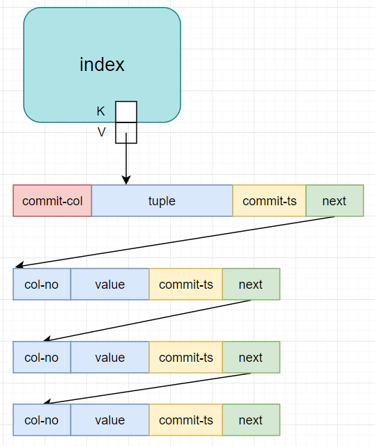

# xjbDB

新开一个 branch 叫做 **mvcc-trial**。   
**这个mvcc实现我是不打算能用的，主要为了搞懂一些细节。**

通过 index 找到 v，即一条 record，后面跟了一串 delta chain（old2new）

- 对于读操作，检查 commit-col 中需要读的 col
  - 如果没有被锁，就进入 chain，逐个 apply delta
  - 如果被锁，则自旋等待
- 对于写操作，记录 read/write set，进入 validation
  - 检查 read set
      - 沿着 delta chain 向下，如果有列冲突，并且 commit-ts 比 自己begin-ts 大，就认为冲突
  - 锁住 write set 对应的列
  - 获得 commit-ts
  - 更新 delta chain
  - 释放列

-----

新开一个 branch 叫做 **presentation-opt**，用于交付学校的暑期实验项目。

基于 branch presentation 做了一些工作：

### Bug fixed

- [issue#11 BUG: doUpdate cnt error](https://github.com/rsy56640/xjbDB/issues/11) , fixed in [`1718dad`](https://github.com/rsy56640/xjbDB/commit/1718dad576cb9669e9b764046e91b0579452b75f)
- [issue#9 BUG: WAL, replay undo log on FREE page will cause overwrite error](https://github.com/rsy56640/xjbDB/issues/9), fixed in [`d7adeb9`](https://github.com/rsy56640/xjbDB/commit/d7adeb92441d8da8231b331d489200e2439d5c4e)
- 

### 功能及优化

- 
- 
- 

### branch presentation-opt 的文档

- [设计文档](https://github.com/rsy56640/xjbDB/tree/presentation-opt/doc)
- [参考资料](https://github.com/rsy56640/xjbDB/tree/presentation-opt/reference)

-----

## Branch "presentation"

Team Project for Software Engineering course

- [设计文档](https://github.com/rsy56640/xjbDB/tree/presentation/doc)
- [参考资料](https://github.com/rsy56640/xjbDB/tree/presentation/reference)

为了软件工程课程的项目展示，新开一个branch叫做 presentation，其中 sql 不支持 subquery。主要原因是我现在没有想清楚，对于复杂查询，表名和列名如何变化，以及这之间的映射应该谁来维护。

## 项目使用

### 一些宏的说明
- `_xjbDB_MSVC_`：/src/include/env.h，主要是一些基础类型
- `_xjbDB_RELEASE_ `：/main.cpp，程序入口
- `SIMPLE_TEST`：/src/page.cpp，页锁，用于并发B+树，定以后表示单线程B+树
- `_xjbDB_test_STORAGE_ENGINE_`：/test/test_storage_engine.cpp
- `_xjbDB_test_BPLUSTREE_`：/test/test_Bplustree.cpp，测试B+树，和 `std::map` 对拍
- `_xjbDB_test_VM_`：/test/test_vm.cpp，用来发布
- `_xjbDB_TEST_QUERY_`：/test/test_query.cpp，测试 sql 解析成 query plan

使用 VS 的话，预定义 `_xjbDB_MSVC_`，`_xjbDB_RELEASE_ `，`_xjbDB_test_VM_` 就行，可选定义 `SIMPLE_TEST`（反正事务不是并发的）   
使用 GCC 或者 Clang 的话，就在 /src/include/env.h 中定义相应基础类型，然后预定义 `_xjbDB_GCC_` 或者 `_xjbDB_Clang_` 就行。

/src/include/debug_log.h 中的一些bool常量：用于开启 log 输出，对于 debug 或者 想了解并大脑跟进执行流程 非常有用

## 目前 presentation 版本 支持 和 不支持 的操作

- 长度限制（参考设计文档）
- FROM 之后最多跟2个表
  - FROM a
  - FROM a, b
  - FROM a JOIN b
- UPDATE 不能 SET PK
- 没有 Query Optimization

## 谈一谈最近的经验
基础服务很重要，前期存储引擎里面的基础服务抽象的挺不错。比如：

- page 层对 k-v 的服务
- B+树迭代器
- VirtualTable 作为一个 channel

写 query process 的时候有点赶，基本是上来就写，基础服务做的很不好。   
在抽象基础服务之前，需要在大脑中过一遍整个执行流程的细节，最好是把每个模块之间的交互都要模拟一遍，这样才知道怎么提供一套infra。写存储引擎之前，我大概把 《SQLite Database System Design and Implementation》 翻了一遍，并且把一些重要细节理清了，才动手开始写，在写B+树之前就已经想好了page层需要提供什么服务了。    
query process 的基础服务做的很烂，主要有几点：

- 逻辑列（`std::string`）到物理列（`DB::page::range_t`）的映射，这个我在用的地方才现场翻译，，实在太糟糕了
- FK 的处理，这个我没看一般DB是怎么写的，，自己胡写，做了一个 pk view 在内存里，然后每次修改都手动维护
- 关于 NULL 的支持，我现在的想法是在每个物理列之前用1B来标记，，但是基础服务抽象的太差了，，很多物理列都是当场用的时候手写，所以现在很难加了

## 一些值得优化的地方

- query process 的基础服务
- WHERE 中可以把 PK 的判断单独提出来，这样就可以用到B+树上的pk查询范围
- 能否设计一个协议，让 query plan 使用物理列
- 数据库历史统计信息（由于 query 树是流式处理，所以join的时候不知道输入表的行数，只能随机等一个）

## 随便谈谈

我写到VM才发现没法做并发控制，因为不知道怎么上行锁，所以B+树的并发操作看起来也没用了。。另外我看 sqlite 的VM是执行 query compilation 之后的生成代码的，但是我们这边没人懂 code gen，所以还是对 operator tree 做解释执行，算是个假的虚拟机吧，唯一一个不错的点就是在 Volcano 上做了一个 channel。VM之后的基础服务没想好就开始写了，导致把一些实现细节耦合在整体逻辑里了。   
这次debug做得还不错，基本把整个流程全部输出出来人肉跟踪了一遍，印象里B+树好像也没什么bug，一开始还被 sqlite 骗了。
