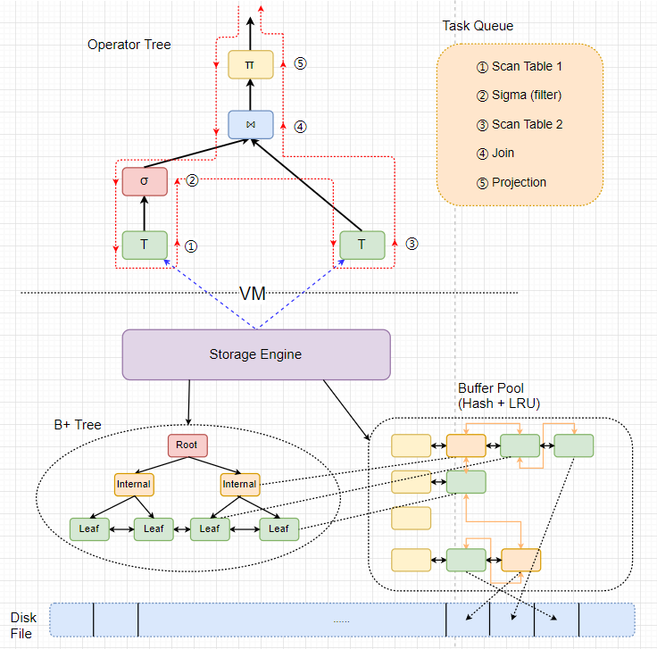
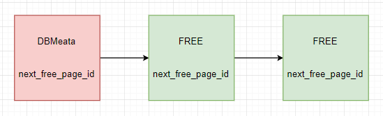
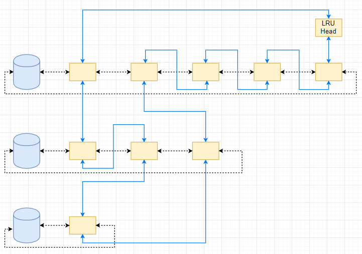
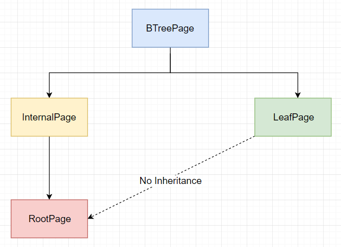
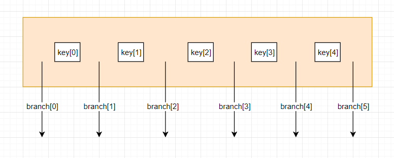
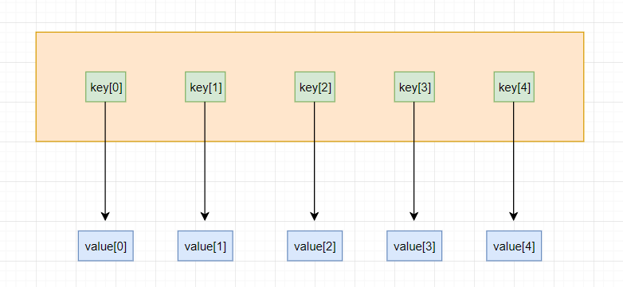
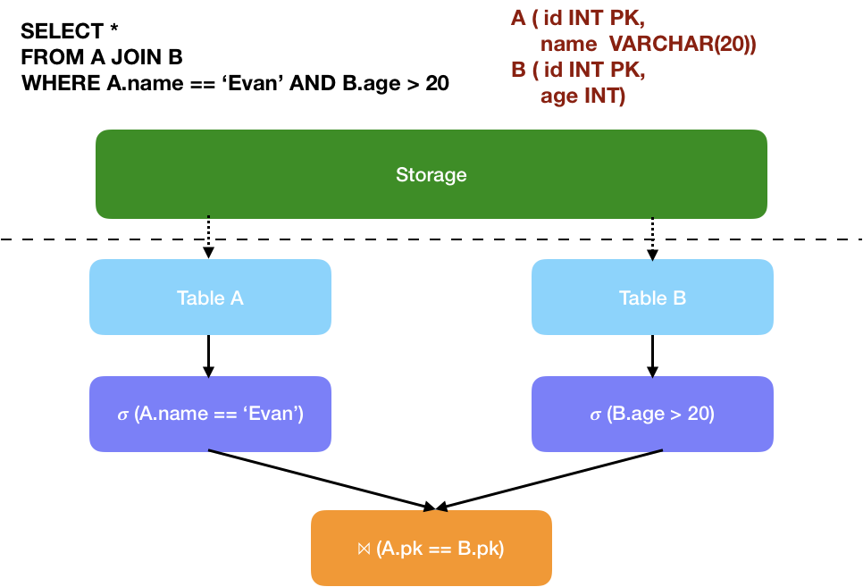
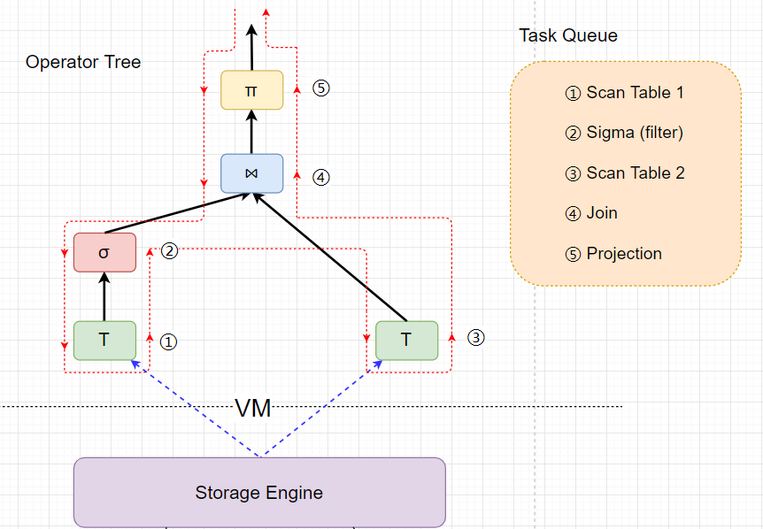

# xjbDB：一个 xjb 写的 DB

- [整体架构](#0)
- [数据库的限制](#1)
- [Pager](#2)
- [Tree](#3)
- [VM](#4)
- [SQL Description Parser](#5)
- [Query Plan](#6)
- [Operator Tree's post order traversal，Pipeline Channel 与 FIFO Task Queue](#7)


&nbsp;   
<a id="0"></a>
## 整体架构



> 使用 [xjbDB.drawio](https://github.com/rsy56640/xjbDB/blob/presentation/doc/xjbDB.drawio) 登录 [draw.io](https://www.draw.io/) 看矢量图

&nbsp;   
<a id="1"></a>
## 数据库的限制

- 支持的数据类型：int, char, varchar（字符串有效长度 <= **57**B）
- 一个 tuple 的长度 <= 66B
  - INT 4B
  - VARCHAR(n)  始终占 n B，如果少，用 `'\0'` 填充
  - 例如：INT, VARCHAR(15), INT, CHAR(20) 占 4+15+4+20 B
- 数据库中最多有30张表，每张表最多15个column
- 事务是串行化处理的
- 列的限制
  - FK 不能是 DEAULT
- UPDATE 不能改 PK


&nbsp;   
<a id="2"></a>
## Pager

文件名：file.xjbDB   
日志名：file.xjbDB.log

### DB Meta
- (4B) page_t
- (4B) page_id
- (4B) cur_page_no
- (4B) table_num
- (4B) next_free_page_id
- (8B * (table_num))
  - (4B) table_page_id
  - (4B) name_offset
  - ...
- table_name 字符串（从260B开始，每25B一个block）

限制：

- table_num <= 30
- table_name <= 24B

支持的基本操作：

- 根据 table 名找到 table_id，若不存在，返回 `NOT_A_PAGE`
- 创建 table：找到一个 `OBSOLETE` 的 record，然后写入
- 删除 table：将 `index` 所对应的 record 标记为 `OBSOLETE`，并且所有table整体前移。

### Table Meta Page
- (4B) page_t
- (4B) page_id
- (4B) BT_root_id
- (4B) col_num
- (4B) row_num
- (4B) default_value_page_id
- (4B) auto_id：如果没有PK
- (14B * 15) table_meta_info
  - (4B) col_name_offset
  - (2B) col_type
  - (2B) str_len (used when col_type is CHAR/VARCHAR)
  - (2B) constraint_type
  - (4B) value (used when constraint_type is DEFAULT(value_offset) or FK(table_id))
- col_name 字符串（从238B开始，每一个block 51B）

限制：

- 每个table最多15个column
- 每个 column 名字最多 50B

支持的操作：

- 插入一个 column，并可能设置 default_value

### Internal Page
- (4B) page_t
- (4B) page_id
- (4B) parent_page_id
- (4B) nEntry 有几个 key
- (2B) key_t `INT` 或 `(VAR)CHAR`
- (2B) str_len 如果 key_t 为 `(VAR)CHAR`，指定长度
- (4B * (2nEntry+1))
  - (4B) 孩子 page_id
  - (4B) key `INT` 或 `(VAR)CHAR`
  - ...
  - ...
  - (4B) 孩子 page_id
- key 字符串（从152B开始，每58B一个block）

支持的基本操作：

- 插入 key：找到一个 `OBSOLETE` 的 record，然后写入
- 删除 key：将 `index` 所对应的 record 标记为 `OBSOLETE`

### Value Page（不进入 buffer pool，生命周期由 Leaf 或 RootLeaf 控制）
- (4B) page_t
- (4B) page_id
- (4B) parent_page_id
- (4B) nEntry 有几项
- 15 个 record（从 16B 开始）

record 格式为：`mark(1B), content(<=66B)`   
把 1024B 分成 15个 67B，这样每个67B是一个block，管理起来很方便。   

支持的基本操作：

- 插入：遍历这15个block，找到一个 `OBSOLETE`（即0）
- 删除：标记这个block为 `OBSOLETE`

### Leaf Page
- (4B) page_t
- (4B) page_id
- (4B) parent_page_id
- (4B) nEntry 有几个 k-v
- (2B) key_t `INT` 或 `(VAR)CHAR`
- (2B) str_len 如果 key_t 为 `(VAR)CHAR`，指定长度
- (4B) value_page_id
- (4B) previous_page_id
- (4B) next_page_id
- (8B * nEntry) nEntry 个 k-v
  - (4B) key `INT` 或 `(VAR)CHAR`
  - (4B) value-index，指向 value_page_id 中该内容的 index（index*68 即可得到 Value Page 中的 offset）
- key 字符串（从152B开始，每58B一个block）

支持的基本操作：

- 插入 value：调用 `value_page->insert()`
- 删除 value：调用 `value_page->erase()`

### FREE Page List



维护一个链表，表头是 DBMeta 中的 `next_free_page_id`，指向下一个 free-page，之后的 free-page 有两个属性：`page_t_` 是 `FREE`，`page_id_` 不是自己，而是 `next_free_page_id_`，最后一个 free-page 指向 `NOT_A_PAGE`

#### 保证 free-page-list 中的 page 一定不在 buffer pool 中；并且 vm 中的 next_free_page_id 永远和 disk_manager 中保持一致

当在 B+Tree 中发生 merge 时，会调用 `Page::set_free()` 标记。随后的 `VM::flush()` -> `Hash_LRU::flush()` -> `virtual xxPage::update_data()` 会将标记为 `FREE` 的 page 中的 `page_id_` 写成 `next_free_page_id`，随后从 buffer pool 中去除，在盘上形成链表。

另一方面，请求分配 page 时，`DiskManager::AllocatePage()` 检查是否还有 free page，并且更新 disk 和 vm 到下一个 free page

### DiskManager


### Log 协议

- undo 是记录事务执行前所有在事务中被修改的页的二进制拷贝，新加入的页不拷贝
- redo 直接记录 sql 语句，重启时塞到 sql pool 里面当做从控制台读入的

log 的第0页作为 LogMetaData，之后顺序放每个脏页的拷贝。

MetaData 结构：

- sql 语句
- ...
- 末尾处，连续的24B
- nuance：一个随机数
- nuance+1：我怕一个出事，再加一个
- undo_log_num：拷贝的脏页对应的原页数量
- undo_check：拷贝的所有页的每4B看作int累加，再加上 nuance
- redo_sql_len：sql 长度
- redo_check：同 undo_check

流程

- 先拷贝脏页对应的原页
- 计算一下这些值
- 先把 nuance 写成 0，让 check fail
- 写 nuance+1, undo_log_num, undo_check, sql 语句, redo_sql_len, redo_check
- 写 nuance
- 数据文件落盘
- 破坏 log：把 nuance 改成 0

恢复

定义 **check-fail**：nuance 不正常；或者 nuance 和 undo_check 计算不一致

- 只要 check-fail，则认为不需要恢复
- 否则
  - 如果 sql 为空并且检查一致，那么只需要 undo
  - 如果 sql 非空并且 check 计算一致，那么需要 undo 和 redo
      - 这里的 redo 是把 sql 发送回 sql pool
  - 如果 sql 非空并且检查不一致，那么 gg

回放：undo

- 把拷贝的页读出来，直接覆盖对应的数据文件的页
- 之后 `VM::start()` 拿到的第一个 sql 就是 redo sql

### BufferPoolManager

- 管理所有 Page，除了3个：**DBMetaPage 和 TableMetaPage**，它们总是被 VM 管理；**ValuePage** 总是被 LeafPage 或 RootPage 管理
- 一个 Page，如果不在 BufferPool 并且还在内存，那么一定在 DiskManager 中被标记为 dirty。（在 evict 时标记为 dirty；注：事实上我已经取消了 `lru_evict`）

#### Concurrent Hash + LRU

结合了 hash 与 lru，结点构成：`page_id`, `Page*` 和 4个指针：`prev_hash`, `next_hash`, `prev_lru`, `next_lru`   
每个 hash bucket 中都是一个双向链表；整个 LRU 也是一个双向链表。



如果不需要支持多线程，那么下面这个结构就可以：其中 lru 持有真正的数据内容，hash 加快索引。

```cpp
std::list<pair<Key, Value>> lru;
std::unordered_map<Key, list<pair<Key, Value>>::iterator> hash;
```

需要多线程时，让两者其中某一方持有数据都不合适，于是就让它俩是一个结点了。（参考 levelDB/util/cache.cc LRUCache）

- find
  - 在 hash bucket 里面找，这里把结点 ref 一下，防止 evict
  - 进了 lru，unref 结点，然后 update lru（即把结点放到开头）
- insert
  - 添加进 bucket
  - 再添加进 lru
- erase
  - 把结点 ref 一下，**防止 evict 和 erase 同时搞一个结点**，然后从 bucket 中移除
  - 进入 lru
      - 如果已经被 evict，那么只 unref 结点（不 `size--`，冲突时 evict 负责 `size--`）
      - 否则正常删除，unref 结点，并 `size--`
- evict（private）
  - `size--`
  - 把结点 ref 一下，然后从 lru 中删除
  - 进入 bucket
      - 如果已经不在了，只 unref 结点
      - 正常删除，并 unref 结点
- rehash（private）
  - 全局写锁（其他操作都要拿全局读锁）
  - bucket 数量翻倍（注意 `std::deque::resize(size_t)` 不要求 copyable 或 movable 语义）
  - 遍历原来的每一个桶
      - 如果 hash 值不是这个桶，那么把它平移到后面那个桶里去，距离就是原来的 bucket 数量
      - 否则不动

> 说明一下，我现在已经把 `lru_evict()` 取消了，相当于就只剩下 hash   
> 原因在于：   
> 如果 evict 时 victim 还在使用，那么外部会持有一个 ref，这时另一个线程过来请求，那么就必须要阻塞，直至 victim flush 或者重新回到 buffer，这样子又需要唤醒机制。总之这之间的同步比较麻烦，干脆不做了。


&nbsp;   
<a id="3"></a>
## Tree

让 VM 以 table 为视角处理，向下管理 page，使用 B+tree。

注意：

- 并发 B+，leaf chain
- 日志
- table 元信息，checksum，magic num


BTreeDegree = 8，所以 nEntry 在 [7, 15]

如果 key 是字符串，key记录offset   
keystr强制 <= 57B，于是从 152B开始，每58B一个block   
格式为：`mark(1B), content(<=57B)`   

关于 Page 的引用计数，除了 root 一直保留，其他 page 用完就 `unref()`。


### B+树的实现
一开始被 sqlite3 骗了，《SQLite Database System Design and Implementation》上说 root 只能是 internal，写着写着愈发觉得诡异，搞得我快自闭了。直到看了《Fundamentals of Database Systems (7th edition)》 $17.3.2，才发现 root 一开始就是 leaf。然后我自己设计了一套B+树算法，应该是正确的：)

#### B+树的结构

总共有2种类型的结点：internal 和 leaf   
**注意：root 结点既可以是 internal，也可以是 leaf**   
每个结点的 `nEntry` 都在 [7, 15]



##### internal 结点
key 数量记为 `nEntry`，branch 数量为 `nEntry+1`



它们 key 的关系是：（`branch[i]` 表示其中的所有 key 值）   
`branch[0] <= key[0] < branch[1] <= ... <= key[4] < branch[5]`

之后我们称 **确定 index**，是指找到第一个 index，使得 `kEntry <= node.key[index]`（index 允许是 `node.nEntry`）

**一个重要性质**：**internal 结点中的 key 值一定会出现在 leaf 中。（因此，internal 中的 key 一定是左边分支的 right-most key）**

##### leaf 结点




#### serch 操作
- 对于 internal 结点
  - 确定 index
  - 从 `node.branch[index]` 递归往下走
- 对于 leaf 结点
  - 直接找

&nbsp;   
#### insert 操作

- 从 root 进入
  - 如果 root 满，那么先 split
  - 确定 index
  - a) 如果 root 是 leaf
      - 检查冲突并尝试插入，插入前其他kv向后移动
  - b) 如果 root 是 internal
      - 如果 `node = root.branch[index]` 满，那么 split，注意 split 之后有可能调整 index（+1）
      - 调用 `INSERT_NONFULLINSERT_NONFULL(node)` 向下

<a></a>

&nbsp;   

`INSERT_NONFULLINSERT_NONFULL(node)` 要求 node 是 **非满的** 并且 **非root**

- a) 如果 node 是 leaf
  - 确定 index，检查冲突并尝试插入，插入前其他kv向后移动
- b) 如果 node 是 internal
  - 确定 index
  - 如果 `child = node.branch[index]` 满，那么 split，注意 split 之后有可能调整 index（+1）
  - 调用 `INSERT_NONFULLINSERT_NONFULL(child)` 向下

> node 非满的性质是在 `split(child)` 时用到的

&nbsp;   

split 分为 `split_internal` 和 `split_leaf`，要求 node 是 **非满的**

- `split_internal(node, index, L)`，其中 `L = node.branch[index]`
  - 创建一个 internal 结点，称作 `R`
  - 把 `L.key[8..14]` 移到 `R.key[0..6]`，`L.branch[8..15]` 移到 `R.branch[0..7]`
  - 更新 parent_id
  - 将 `node.key[index..]` 和 `node.branch[index+1..]` 右移
  - 将 `L.key[7]`（删除） 向上提到 `node.key[index]`，并设置 `node.branch[index+1] = R`
- `split_leaf(node, index, L)`，其中 `L = node.branch[index]`
  - 创建一个 leaf 结点，称作 `R`
  - 把 `L.key-value[8..14]` 移到 `R.key-value[0..6]`
  - 调整 leaf-chain
  - 将 `node.key[index..]` 和 `node.branch[index+1..]` 右移
  - 设置 `node.key[index] = L.key[7]`，`node.branch[index+1] = R`

&nbsp;   
#### delete 操作


&nbsp;   
#### 其他注意事项

每次要维护的一些数据成员:

- BTreePage
  - `nEntry_`
  - `keys_[0..14]`
  - `parent_id_`
- InternalPage
  - `branch_[0..15]`
- LeafPage
  - `values_[0..14]`
  - `left_` and `right_`

<a></a>
&nbsp;   

- steal branch 时要注意
  - set node[index] = max_KeyEntry(..)
  - update parent_id


&nbsp;   
<a id="4"></a>
## VM

我想了很久，决定让事务串行化执行，没有并发控制。   
主要原因是：我没有搞懂怎么在B+树里面上**行锁**，而且B+树的kv操作都是一遍下去拿着page锁，提前也不知道锁在哪的。。。

### 读入 sql

开一个线程，专门负责从命令行读入，每当遇到 `';'`，就送进 sql pool。   
碰到一个有趣的问题：参考 issue#2 https://github.com/rsy56640/xjbDB/issues/2 ，用户输入 `"EXIT;"`，放进 sql pool 之后，就阻塞在 `std::cin::getline()` 上了，vm 没办法通知这个线程，所以还得检查 `"EXIT;"`。

### VM 初始化

对于空DB，初始化 DBMetaPage。   
对于非空DB，rebuild 过程如下：

- 检查 log，如果需要，就做 undo 和 redo
- 读入 DBMetaPage
- 读入所有 TableMetaPage
- 扫一遍所有 table 的 B+树，统计 PK view（*我还没研究过正经数据库是怎么做的*）
- 开启 任务池 和 sql读入线程

### VM 运行

`VM::start()`：`while(true)` 循环，流程如下：

- 拿 sql（阻塞地从 sql pool）
- 解析 sql，得到 plan
- 保存当前 `cur_page_no`
- 执行 Query Plan
- 如果 `"EXIT;"`，就退出
- 等待任务池中所有任务结束
- doWAL：找到 dirty_page_set 中 < 之前 `page_no`，这些 page 全部 copy 到 log（用来做 undo），并写 log metadata（如果 sql 语句不长，就记录下来做 redo）
- Flush：落盘
- 销毁 log metadata

### Query Process
总共有6种：

#### doCreate
注意一些 constraint 信息：

- auto PK
- FK table ID
- Default Value

#### doDrop

- 检查 FK 约束
- 从 DB meta 中删除
- destruct 整棵 B+树
- 从 table meta 中删除，但是**不立即析构，而是等到 WAL 之后才析构落盘**
- 清除 PK view

#### doSelect

总共有4种结点：

##### scanTable
从对应的B+树里面拿 row（*可能的优化：把 PK 判断单独提出来，就可以在B+树上缩小范围*）

##### sigma
对输入的所有 row 做 filter

##### projection
选择要投影的列（*可能的优化：在物理列上压缩，可选地实现 lazy压缩。但是现在我还没有设计好协议，所以就没有压缩，反正现在也没有子查询*）

##### join
因为现在不支持子查询，所以表名和列名我就随便拼了。   
根据是否是 pk join 来准备新表的 `TableInfo`：

- 新表名叫做 "表1 JOIN 表2 ON PK" 或 "表1 JOIN 表2"
- 新列名是 "原表名.原列名"
- pk 列叫做 "表1.表1pk列名"
- 表2的物理列要往后平移

-----

### Join 优化 负责人：朱申

#### PK Join

由于在数据库中，所有表的PK都是按升序排列的。根据这个性质，我们不需要首先拿到一个表的所有行，只需要比较当前从管道获取两个PK的大小关系。具体的实现细节如下：

我们使用了双迭代器模式遍历这两个表。比较这两个迭代器中PK的大小。由于PK都是按照升序排列，如果两个PK大小相等，我们把这两个行拼接，然后输送到输出管道中；如果其中一个PK小于另一个PK，我们便让较小PK的迭代器向下走，直到其中一个迭代器到达表的末尾时停止迭代。

#### 非PK Join

最直接的非PK Join为首先获取两个表的所有 `row_view`， 然后双重for循环，做Cartesian Product。但是这样会面临很大的效率问题；第一是时间上的问题，首先对于两个表调用 `VirtualTable::waitAll()` 函数来获取这个表的所有行 `VirtualTable::waitAll()` 函数后的操作必须要等其中较慢的一个函数结束之后才能继续执行，这样如果一个表非常庞大，会需要很长的等待时间。第二个随之而来的问题是内存的开销，如果需要把一个很大的表的所有行都存到内存中，会占用很大的内存。

我们暂时对此问题的处理方案是只对第一个表调用 `VirtualTable::waitAll()` 函数，然后不断消费第二个表管道中生成的 `row_view`，这样可以解决时间以及内存问题。当然，这个方法在第一个表很大的时候没有太大的作用，我们下一步的优化方案是根据数据库的历史统计信息来调整选择哪个表调用 `VirtualTable::waitAll()` 阻塞。



-----

#### doUpdate

- 遍历所有行（*可能的优化：把 PK 判断单独提出来，就可以在B+树上缩小范围*）
- 因为有可能**某些 cell 的 update 违反 FK 约束，所以对 PK view 采用一种类似  2PC 的方法来更新**：记录下要增加或删除的 pk 的 ref 的引用，直到最后确认该 row 可以被 update，那么修改内容，并提交这些 pk ref 的变更（+1 或 -1）

#### doInsert

- 准备 auto PK, Default Value
- 检查 FK constraint
- 插入B+树
- 更新 PK view 和 某些列的 fk 对应的 PK view

#### doDelete

- 遍历每一行，检查 FK 约束，记录可以删除的 key-value（*可能的优化：把 PK 判断单独提出来，就可以在B+树上缩小范围*）
- 从B+树上删除这些 key，并删除 key 对应的 PK view
- 对于 key 对应的 value，将其中 FK 对应的 PK view 的引用计数减一


&nbsp;   
<a id="5"></a>
## SQL Description Parser
### 模块负责人：黎冠延
[ssyram/NovelRulesTranslator](https://github.com/ssyram/NovelRulesTranslator)


&nbsp;   
<a id="6"></a>
## Query Plan
### 模块负责人：刘瑞康
[Reeker-Liu/DB](https://github.com/Reeker-Liu/DB)

> 当前版本没有 query optimization，也就是 sigma 结点其实在 join 结点之后


&nbsp;   
<a id="7"></a>
## Operator Tree's post order traversal，Pipeline Channel 与 FIFO Task Queue

主要idea：**在 Volcano 模型中使用 Pipeline 方式来执行 query**



### VirtualTable as Channel

**首先讲一下 `VirtualTable`， 作为 query 的中间表，其本身是一个 Channel，提供了一个 pipeline 的生产者消费者模型。**

```c++
    class VirtualTable
    {
        struct channel_t {
            std::queue<row_view> row_buffer_;
            std::mutex mtx_;
            std::condition_variable cv_;
        };

    public:
        // for producer
        void addRow(row_view row);
        void addEOF();
        
        // for consumer
        row_view getRow();                  // might be stuck
        std::deque<row_view> waitAll();     // might be stuck

    private:
        std::shared_ptr<channel_t> ch_;
    };
```

- 对于消费者
  - `row_view getRow();`：阻塞式地消费一个 row
  - `std::deque<row_view> waitAll();`：阻塞式地一次性全部拿出来
- 对于生产者
  - `void addRow(row_view row);`：插入新的 row
  - `void addEOF();`：标记结尾

### Volcano 模型中使用 pipeline

与 Volcano 模型 的 `next()` 不同，每一个 op 结点都只实现了 `VirtualTable getOutput();`，并且**只调用一次**。   
在执行 operator tree 时，我们对根结点调用 `getOutput()` 来 dfs 遍历整棵树。（如上图中红色虚线所示）

- **前序遍历**到一个结点时
  - 如果是 scanTable 结点，那么直接继续该结点的后序遍历
  - 否则，调用子结点的 `getOutput()` 继续向下遍历
- **后序遍历**到一个结点时
  - 创建 `VirtualTable`，即一个 Channel
  - 向任务队列注册该结点的任务（注册任务是阻塞的，任务执行是异步的，并且是 FIFO）
  - 返回 `VirtualTable` 给父节点，至此，两个结点间的管道建立完毕

比如 sigma 结点的 `getOutput()`

```c++
    VirtualTable FilterOp::getOutput()
    {
        // pre-order traversal
        VirtualTable table = _source->getOutput();
        // post-order traversal
        return vm_->sigma(table, _whereExpr);
    }
```

### FIFO task queue & post-order traversal

任务队列（如上图所示）

- ① Scan Table 1
- ② Sigma (filter)
- ③ Scan Table 2
- ④ Join
- ⑤ Projection

注意到一个性质：**后续遍历到一个结点时，其子树一定已经被后序遍历过了，那么该结点任务一定排在所有子树结点任务之后**。换句话说，之前的 channel 已经建立完毕，直接在结点任务中消费然后向自己创建的 channel 生产就可以了。   
于是大胆推测一下（xjb扯）：只要结点任务不太卡，那么几乎可以做到完全并发（即任务队列中的执行线程数），除了 join 结点有时会成为 pipeline breaker。   
关于并发性的xjb分析：

- 任务队列中线程的创建与回收
- 阻塞
  - 一个 row 阻塞
  - join 结点拿所有 row 阻塞
