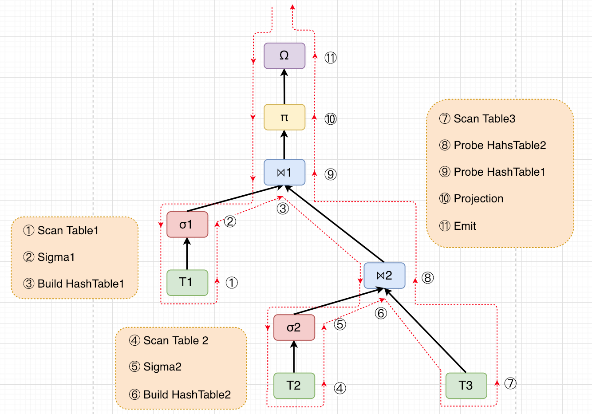

# codegen 流程分析



关于 push-based 模型，考虑遍历整个 query tree

- 前序遍历到某一个节点时
  - 如果是 scan table 节点，什么也不做
  - 递归地向下遍历（即让子树生产）
- 后序遍历到某一个节点时
  - 已经获得子树的生产结果，消费，并向上返回结果
- 对于 hash join 节点
  - 中序遍历时，用左方子树的生产结果进行 build
  - 后序遍历时，用右方子树的生产结果进行 probe

> 即图中遍历路线中的红色箭头

&nbsp;  
有两种方式来处理这个棵树：1. 递归；2. 显式 stack。相比之下，stack 的方式对全局的掌握更好，方便对任务进行切割（评估每个 operator 的 workload，并进行 operator fusion）

**exectuion operator（pipeline）** 定义：一组 operator 的队列，作为一个执行单元，codegen 后可以 pipeline 执行。  

&nbsp;  
**操作流程**：

- 遇见正常任务
  - 评估 workload，考虑是否创建新的 exectuion operator（这个是并发维度的考虑，可以不需要）
      - > 比如 scan table 节点要扫描1亿行，之后是一个 sigma，那么可以把 scan table 这个 小operator 视为一个 exectuion operator。于是之后可以让线程池同时执行 scan table 和之后的 sigma
  - 加入 exectuion operator
- 遇到 pipeline breaker
  - 完结 exectuion operator（比如 hash build operator 通常作为 exectuion operator 结尾）
  - 初始化新的 exectuion operator

结果：得到一个 exectuion operator 队列，可以按顺序喂给线程池，即获得 exectuion operator 维度的并发

&nbsp;  

operator 队列可以看作是从 query tree 得到 “**control/data flow 的抽象**”

- **control flow**
  - 对于每一个 exectuion operator，按顺序做 codegen 即可，push-based
- **data flow**
  - 在 codegen 时，**每个 exectuion operator 都会生成一个 loop**，**另外有一个全局的 breaker obj 生成在 loop 之前**（**这个 obj 由当前 pipeline 结尾的 breaker 确定**，用于存储数据，并用于之后的消费）
  - 维护一个 breaker stack，存储每个 pipeline 的生产结果；在 pipeline 执行过程中可以消费，在 pipeline 结束后，将自己的 breaker 加入进去


```c++
HashTable ht1;
for(t : T1) {
    if(pred1(t)) {
        ht1.build(t);
    }
}

HashTable ht2;
for(t : T2) {
    if(pred2(t)) {
        ht2.build(t);
    }
}

Emit emit;
for(t : t3) {
    t_23 = ht2.probe(t);
    t_1_23 = ht1.probe(t_23); // 如何拿到 “ht1” 这个名字，使用 “breaker stack”
    t_proj = proj(t_1_23);
    emit.emit(t_proj);
}
```

> 最上方图所生成的伪代码。每个 pipeline 都对应一个 breaker obj 和一个 loop；breaker obj 分别对应 3，6，11，即每个 pipeline 结尾的 breaker；消费时根据 breaker stack 消费

&nbsp;  

**对每一个 exectuion operator（pipeline）来说，codegen 分为三步**

- 生成一个 breaker 初始化
- 生成一个 loop 表示 pipeline 内所有 operator 的计算过程（可能要消费 breaker stack）
- 将 breaker 加入 breaker stack

> （可选）并发策略：只要一个线程池和任务打包函数就可以无缝对接当前流程   
> 1. 将 breaker 设计成 async handle，在消费时才阻塞（比如最后的 probe 等待 build 完成）   
> 2. loop 的计算过程打包成一个异步任务，交给线程池调度（简单点就 fifo 调度）   

```c++
using operator_node_t = std::shared_ptr<std::variant<Scan, Sigma, Join...>>;
struct exectuion_operator_t {
    std::deque<operator_node_t> operators;
    // other metadata
    void push(operator_node_t);
    void clear();
    // ...
};
exectuion_operator_t exectuion_operator;
std::deque<exectuion_operator_t> tasks; // we have control/data flow all in here !!!
void renew_exectuion_operator_exectuion_operator() {
    tasks.push_back(std::move(exectuion_operator));
    exectuion_operator.clear();
}

struct visit_node_t { 
    operator_node_t node;
    uint32_t times;
};
std::stack<visit_node_t> stk;
stk.push({root, 0});

while(!stk.empty()) {
    visit_node_t node = stk.top(); stk.pop();
    const uint32_t times = node.times;
    match(node.node) {

        Scan => {
            exectuion_operator.push(scan);
        },

        Sigma => {
            if(times == 0) {
                stk.push({sigma, 1});
                stk.push({sigma.source, 0});
            }
            else {
                exectuion_operator.push(sigma);
            }
        },

        Join => {
            if(times == 0) {
                // init_hashtable(); 并非前序遍历时创建 hashtable
                stk.push({join, 1});
                stk.push({join.left, 0});
            }
            else if(times == 1) {
                exectuion_operator.push(join.build());
                renew_exectuion_operator();
                stk.push({join, 2});
                stk.push({join.right, 0});
            }
            else {
                exectuion_operator.push(join.probe());
            }
        },

        Emit => {
            if(times == 0) {
                stk.push({emit, 1});
                stk.push({emit.source, 0});
            }
            else {
                exectuion_operator.push(emit);
                renew_exectuion_operator();
            }
        },

        _ => {
            ERROR();
        },

    }; // end pattern match
} // end traverse query tree


// codegen from `tasks`
using breaker_t = std::string;
std::stack<breaker_t> breaker_stk;

for(task : tasks) {
    // 1. generate breaker
    breaker_t breaker = task.operators.last().init_breaker(); // may need cast
    
    // 2. generate loop for operator execution
    using row_token_t = std::string;
    row_token_t row_token;
    for(op : task.operators) {
        // fake implementation, maybe need a stack for "}" and other meta info
        op.codegen(row_token, breaker, breaker_stk); // "operator::codegen(row_token_t&, const breaker_t&, std::stack<breaker_t>&);"
    }

    // 3. add breaker to breaker stack;
    breaker_stk.push(std::move(breaker));
}
```

> 生成结果大概就像上面那段代码


&nbsp;  
&nbsp;  
# codegen 对接 mysql 生态

几个核心关注点：

- 树长什么样？
- 树是如何被执行的？
- 如何截获这棵树？
- 树 -> c++ code -> .so
  - 编译的部分
      - where clause：输入 tuple，返回 bool
      - operator tree 是否还需要 compile
          - 需要调研 handler
          - 0
  - c++ code 中对接 storage engine handler？
- 怎么调这个.so

