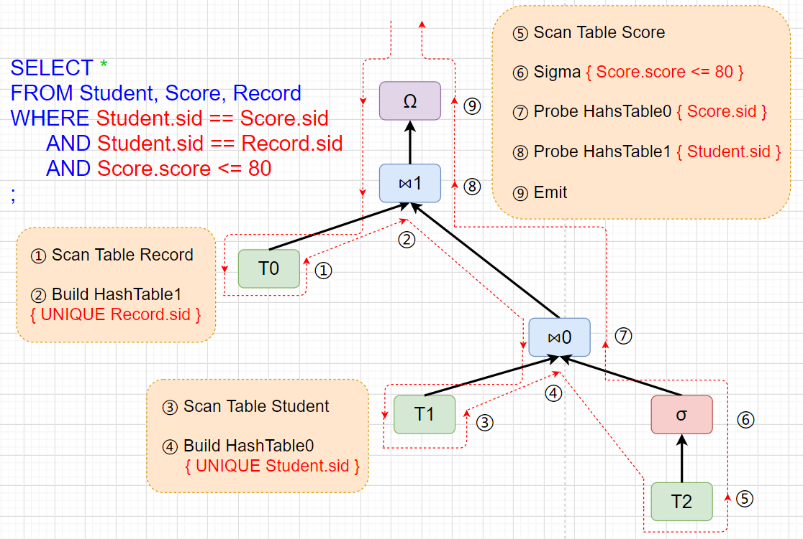

[TOC]


## 主要工作

- mini SQL
  - OLTP文法产生式
  - OLAP文法产生式
  - 词法分析
  - 语法分析
- Expression AST(abstract syntax tree) 结点
- Expression AST工具函数
- OLTP 查询
  - 生成TP Operation AST
  - 解释执行
- OLAP 查询
  - 生成AP Operation AST
  - 生成查询代码
  - 编译代码，动态链接执行


## 架构及实现

#### OLTP文法产生式

```
sqlStatement := ddlStatement | dmlStatement | "SHOW" | "EXIT" | "SWITCH";

ddlStatement := createTable | dropTable;

dmlStatement := selectStatement | insertStatement | updateStatement | deleteStatement;

createTable := "CREATE" "TABLE" tableName createDefinitions;

dropTable := "DROP" "TABLE" tableName;

createDefinitions := "(" createDefinition [{"," createDefinition}*] ")";
 
createDefinition := "ID" dataType [columnConstraint*];

dataType := "INT" | "CHAR" "(" positiveNum ")" | "VARCHAR" "(" positiveNum ")";

columnConstraint := "NOT_NULL" | "DEFAULT" expressionAtom | "PRIMARY_KEY" | "REFERENCES" tableName;

insertStatement := "INSERT" tableName "(" "ID" [{"," "ID"}*] ")" insertElements;

deleteStatement := "DELETE" "FROM" tableName ["WHERE" expression];

updateStatement := "UPDATE" tableName "SET" updateElements ["WHERE" expression];

selectStatement := "SELECT" selectElements fromClause ["WHERE" expression] [orderByClause];

insertElements := "VALUES" "(" expressionAtom [{"," expressionAtom}*] ")";
	
updateElements := updateElement [{"," updateElement}*];

updateElement := columnName "=" expressionAtom;
						  
selectElements := "$" | expressionAtom [{"," expressionAtom}*];

orderByClause := "ORDERBY" orderByExpression [{"," orderByExpression}*];

orderByExpression := expressionAtom ["ASC"|"DESC"];

fromClause := "FROM" tableName [{"," tableName}*] | "FROM" tableName "JOIN" tableName;

tableName := "ID";

columnName := "ID" "." "ID" | "ID";

expression := expression logicalOperator expression | predicate;

predicate := expressionAtom comparisonOperator expressionAtom | expressionAtom;

expressionAtom := constantNum | "STR_LITERAL" | columnName | expressionAtomOp;

expressionAtomOp := expressionAtom {"*"|"/"|"%"|"+"|"-"} expressionAtom;

constantNum := ["-"] positiveNum;
	
positiveNum := "NUMBER_CONSTANT";
				 
comparisonOperator := "==" | ">" | "<" | "<=" | ">=" | "!=";

logicalOperator := "AND" | "OR";
```

*:

JOIN 暂时只支持两表

ORDER BY 暂时没有处理


#### OLAP文法产生式

```
sqlStatement := selectStatement | "EXIT" | "SWITCH" | "SHOW";

selectStatement := "SELECT" selectElements fromClause ["WHERE" expression];

selectElements := "$";

fromClause := "FROM" tableName [{"," tableName}*];

tableName := "ID";

columnName := "ID" "." "ID";

expression := expression "AND" expression | predicate;

predicate := expressionAtom comparisonOperator expressionAtom | expressionAtom;

expressionAtom := constantNum | "STR_LITERAL" | columnName | expressionAtomOp;

expressionAtomOp := expressionAtom {"*"|"+"|"-"} expressionAtom;

constantNum := ["-"] positiveNum;
	
positiveNum := "NUMBER_CONSTANT";
				 
comparisonOperator := "==" | ">" | "<" | "<=" | ">=" | "!=";
```

*：

主要语句仅有SELECT

Select Element暂时仅全选

JOIN使用WHERE条件进行，不再独立使用

逻辑运算符仅支持`AND`

数学运算符仅支持`* + -`


#### 词法分析

轨道

特性


#### 语法分析

OLTP与OLAP均采用语法制导翻译，该部分使用了[同学的项目NovelRulesTranslator](https://github.com/ssyram/NovelRulesTranslator)


#### Expression AST

##### 表达式结点

表达式结点用于构建表达式抽象语法树，主要是WHERE条件、SELECT element

类型包括

- LOGICAL_OP：逻辑运算结点
- COMPARISON_OP：比较运算结点
- MATH_OP：数学运算结点
- ID：表列结点
- NUMERIC：数值常量结点
- STR：字符串常量结点

具体实现

```cpp
//抽象基类
struct BaseExpr {
  BaseExpr(base_t_t base_t);
  virtual set<string> getTables();
  virtual bool isJoin();	//判断以当前结点为根的表达式是否为Join条件

  const base_t_t  base_t_;	//当前结点实际类型，用于指针转换
};

//抽象类，非原子表达式，不能出现在element中
struct NonAtomExpr : public BaseExpr;

//抽象类，原子表达式
struct AtomExpr : public BaseExpr;

struct LogicalOpExpr : public NonAtomExpr {
  LogicalOpExpr(logical_t_t logical_t, BaseExpr* left, BaseExpr* right);

  const logical_t_t logical_t_;	//逻辑运算类型
  shared_ptr<BaseExpr> _left;
  shared_ptr<BaseExpr> _right;
};

struct ComparisonOpExpr : public NonAtomExpr {
  //left,right must be AtomExpr*
  ComparisonOpExpr(comparison_t_t comparison_t, AtomExpr* left, AtomExpr* right);

  virtual set<string> getTables();

  virtual bool isJoin();	//左右子节点均为表列，比较运算为判等，则为Join条件

  const comparison_t_t comparison_t_;	//比较运算类型
  shared_ptr<BaseExpr> _left;
  shared_ptr<BaseExpr> _right;
};

struct MathOpExpr : public AtomExpr {
  MathOpExpr(math_t_t math_t, AtomExpr* left, AtomExpr* right);

  virtual set<string> getTables();

  const math_t_t math_t_;	//数学运算类型
  shared_ptr<BaseExpr> _left;
  shared_ptr<BaseExpr> _right;
};

struct IdExpr : public AtomExpr {
  IdExpr(string columnName, string tableName = string());

  virtual set<string> getTables();

  const string getFullColumnName() const;

  string _tableName;
  string _columnName;
};

struct NumericExpr : public AtomExpr {
  NumericExpr(int value);

  int _value;	//数值
};

struct StrExpr : public AtomExpr {
  StrExpr(const string& value);

  string _value;	//字符串常量值
};
```

例如，对于SQL语句

`SELECT USER.id, Student.sid, Student.name
FROM USER, Student
WHERE USER.id + 1 >= 200 OR Student.name == "xxx";`

其WHERE子句的AST结构如下


##### 打印函数

将表达式AST输出到指定输出流，用于调试、展示以及log日志

```cpp
void exprOutputVisit(shared_ptr<const BaseExpr> root, std::ostream &os);
```


#### OLTP 查询

##### 语法解析结果

在语法指导翻译的过程中，逐级规约产生式时，创建结点，自底向上构建出WHERE语句以及SELECT element的表达式AST。需要指出的是，表达式AST的构建仅按照规约过程进行，此时未做优化处理或有效性检查，仅供解释执行。

除此之外，在不同的过程中，随规约的进行获得并保存对应信息，并在最后构建出对应的查询类型，供后端使用。

##### OLTP类型

```cpp
//===========================================================
//DDL
struct CreateTableInfo
{
    table::TableInfo tableInfo;
    std::vector<table::value_t> defaults;
    std::vector<std::string> fkTables;
    void print() const;
};

struct DropTableInfo
{
    std::string tableName;
    void print() const;
};

//===========================================================
//DML
struct InsertInfo {
    std::string sourceTable;
    Elements elements;
    void print() const;
};

struct UpdateInfo {
    std::string sourceTable;
    Elements elements;
    std::shared_ptr<ast::BaseExpr> whereExpr;
    void print() const;
};

struct DeleteInfo {
    std::string sourceTable;
    std::shared_ptr<ast::BaseExpr> whereExpr;
    void print() const;
};

struct TPSelectInfo {
    std::shared_ptr<ast::TPBaseOp> opRoot;
    std::vector<OrderbyElement> orderbys;
    void print() const;
};
```

*:

print()输出其查询类型用于调试、展示以及log日志

除此之外，OLTP模式下还有几类通用类型

- Exit：退出查询
- ErrorMsg：错误信息
- Switch：切换到OLAP模式
- Show：显示当前数据库信息

##### SELECT Operation AST

查询类型中，TPSelectInfo包含了一个TPBaseOp结点构成的Operation AST。

该AST下一步将被用于解释执行以完成SELECT查询。

结点类型包括

- PROJECT：表列选择
- FILTER：条件过滤
-  JOIN：连接两表
- TABLE：所有叶子结点均为TABLE类型，代表一个表

```cpp
struct TPBaseOp {
    TPBaseOp(tp_op_t_t op_t);
    virtual table::VirtualTable getOutput() = 0;	//获得当前结点处理后的表行

    tp_op_t_t op_t_;	//当前节点类型
};

struct TPProjectOp : public TPBaseOp {
    TPProjectOp();
    virtual table::VirtualTable getOutput();

    std::vector<std::shared_ptr<ast::AtomExpr>> _elements;
    std::shared_ptr<TPBaseOp> _source;
};

struct TPFilterOp : public TPBaseOp {
    TPFilterOp(ast::BaseExpr* whereExpr);
    virtual table::VirtualTable getOutput();

    std::shared_ptr<ast::BaseExpr> _whereExpr;
	std::shared_ptr<TPBaseOp> _source;
};

struct TPJoinOp : public TPBaseOp {
    TPJoinOp();
    virtual table::VirtualTable getOutput();

    std::vector<std::shared_ptr<TPBaseOp>> _sources;
    bool isJoin;
};

struct TPTableOp : public TPBaseOp {
    TPTableOp(const std::string tableName);
    virtual table::VirtualTable getOutput();

    std::string _tableName;
};
```

对于SQL语句

`SELECT USER.id, Student.sid, Student.name
FROM USER, Student
WHERE USER.id + 1 >= 200 OR Student.name == "xxx";`

其OP AST结构如下


TPBaseOp使用以下函数进行输出打印

```cpp
void tpOutputVisit(std::shared_ptr<const TPBaseOp> root, std::ostream &os);
```

后端使用以下函数对表行解释执行，返回bool值即为该表行是否被FilterOp中WHERE条件过滤

```cpp
bool vmVisit(std::shared_ptr<const BaseExpr> root, table::row_view row);
```

后端使用以下函数对表达式解释执行，动态获得表达式的实际值

```cpp
table::value_t vmVisitAtom(std::shared_ptr<const AtomExpr> root, table::row_view row = NULL_ROW);
```

以上两个函数可以看做OLTP的核心内容，进程运行时，从根结点开始，自顶向下递归。对于具体的任一结点，根据其实际类型，在运行时转换指针，获取结果后向上逐级返回。

#### OLAP 查询

##### 语法解析结果

与OLTP不同，OLAP主要为SELECT查询，此外，在语法制导翻译后，OLAP保留多个条件的集合(由AND逻辑运算符分割)，并未构建成AST。

这是考虑到AP构建的AST下一步将用于转换成代码，因此需要良好的结构，而查询语句本身的结构很可能并不优雅，与其构建AST后再拆分重组，不如仅保留平铺的多个简单条件集合，再对条件集合进行分类构建。

##### OLAP查询类型

除APSelectInfo外,包括与OLTP相同的Exit, ErrorMsg, Switch, Show

##### 有效性检查&常量

在构建OP AST前，先对条件集合执行以下函数

```cpp
void apCheckVisit(vector<shared_ptr<BaseExpr>> &conditions);
```

检查简单条件是否为比较表达式、检查表列是否存在

检查同时对常量进行优化处理，如`Student.name == "xx" + "x"`将被优化为`Student.name == "xxx"`

##### SELECT Operation AST结点

在构建前首先介绍一下OP AST结点

类型包括

- EMIT：AP特有根结点，用于特殊处理
- PROJECT
- FILTER
- JOIN
- TABLE

```cpp
class APMap;	// 中间表映射

struct APBaseOp {
    APBaseOp(ap_op_t_t op_t, std::string tableName, APBaseOp *parentOp = nullptr);

    virtual bool isJoin();	//用于快速判断当前是否为Join结点

    // used to traversal
    virtual void produce() {};
    // source are used to check left/right child, map is constructed from bottom to top
    virtual void consume(APBaseOp *source, APMap &map) {};

    void setParentOp(APBaseOp *parentOp);
    std::string get_table_name() const;

    ap_op_t_t op_t_;	//当前节点类型
    std::string _tableName;
    APBaseOp* _parentOp;	//父节点
};

struct APEmitOp : public  APBaseOp {
    APEmitOp(APBaseOp *table, int hashTableCount, int tableCount)；
    
    int _hashTableCount;	//hashJoin总数
    int _tableCount;	//查询涉及的表总数
    APBaseOp *_table;
    APMap _map;  // store the final map
};

struct APProjectOp : public APBaseOp {
    APProjectOp(APBaseOp *table)；

    APBaseOp *_table;
};

struct APFilterOp : public APBaseOp {
    APFilterOp(APBaseOp *table, shared_ptr<BaseExpr> condition);

    APBaseOp *_table;
    shared_ptr<BaseExpr> _condition;
};

struct APJoinOp : public APBaseOp {
    APJoinOp(APBaseOp *tableLeft, APBaseOp *tableRight, col_name_t leftAttr,
             col_name_t rightAttr, int hashTableIndex);

    int _hashTableIndex;	//当前结点分配的hash表序号
    APBaseOp *_tableLeft;
    APBaseOp *_tableRight;
    col_name_t _leftAttr;
    col_name_t _rightAttr;
    APMap _leftMap;
    page::range_t _leftRange;
    bool isUnique;
};

struct APTableOp : public APBaseOp {
    APTableOp(const table::TableInfo& table, string tableName, int tableIndex);

    int _tableIndex;	//当前结点分配的表序号
    APMap _map;
};
```

##### 生成OP AST

在完成了有效性检查和常量优化后，进行OP AST的生成，同样是自底向上构建，构建过程中维护和传递中间表结构到物理列的映射。

首先使用语法制导翻译获得的表信息，对每个表构建APTableOp叶子结点。

然后对条件集合进行筛选，分类成单表条件，Join条件，多表复杂条件。

对于单表条件，在对应的APTableOp结点上构建APFilterOp结点。

对于Join条件，在对应的Join表结点上构建APJoinOp结点，考虑到后续代码生成，若参与Join的结点中仅包含一个子Join结点，将其调整为右子节点。

复杂条件暂时还未处理。

然后在当前最上层结点上根据SELECT element构建APProjectOp结点。

最后，在所有节点最上层，生成一个APEmitOp结点。

需要注意的是，在最后的APEmitOp生成前，需要检查构建的结点树是否为森林。

对于以下SQL语句

`SELECT $ FROM Student, Score, Record
WHERE Student.sid == Score.sid AND Student.sid == Record.sid
AND Score.score <= 80;`

最终生成的AST如下



##### 生成代码

最后一步是根据上一步构建的AST生成查询代码。

其主要功能在APBaseOP结点的虚函数`produce()`和`consume(...)`中完成，每个具体结点自行实现其生成内容。

前者在完成一些基础生成后，调用子结点的相同函数。当调用达到最底层叶子结点也就是APTableOP后，将获得具体的表列到物理列映射，完成对应代码生成后，调用其父结点的后一函数，调用同时将映射和当前来源一并传递。当父结点的后一函数被调用时，将根据来源和映射完成其输出，修改映射，并再次向上调用和传递。

需要指出的是，生成的代码行与AST结构的对应是优雅的。

对于此前生成的AST，由于`produce`生成的代码部分是平凡的，不做标记。序号表示代码为`consume`生成，需要注意，对于JoinOp，该函数会被左右子节点调用两次，分别用两个序号表示。

```cpp
// this file is generated 
#include "../include/ap_exec.h"
#include "../include/vm.h"

static DB::ap::block_tuple_t projection(const DB::ap::block_tuple_t &block) { return block; }

extern "C"
DB::ap::VMEmitOp query(const DB::ap::ap_table_array_t &tables, DB::vm::VM *vm) {
    DB::ap::VMEmitOp emit;
    const DB::ap::ap_table_t &T0 = tables.at(0);	//①
    const DB::ap::ap_table_t &T1 = tables.at(1);	//③
    const DB::ap::ap_table_t &T2 = tables.at(2);	//⑤
    DB::page::range_t rngLeft0{0, 4};							//②
    DB::page::range_t rngRight0{0, 4};						//⑧
    DB::page::range_t rngLeft1{0, 4};							//④
    DB::page::range_t rngRight1{0, 4};						//⑦
    DB::ap::hash_table_t ht0(rngLeft0, rngRight0, 24, 8, true);		//⑧
    DB::ap::hash_table_t ht1(rngLeft1, rngRight1, 8, 32, true);		//⑦
  
    auto pipeline0 = [&]() {		//①
        for (DB::ap::ap_block_iter_t it = T2.get_block_iter(); !it.is_end();) {		//①
            DB::ap::block_tuple_t block = it.consume_block();		//①
            ht1.insert(block);		//②
        }		//②
        ht1.build();		//②
    };		//②
    std::future<void> future0 = vm->register_task(pipeline0);		//②
  
    auto pipeline1 = [&]() {		//③
        for (DB::ap::ap_block_iter_t it = T0.get_block_iter(); !it.is_end();) {		//③
            DB::ap::block_tuple_t block = it.consume_block();		//③
            ht0.insert(block);		//④
        }		//④
        ht0.build();		//④
    };		//④
    std::future<void> future1 = vm->register_task(pipeline1);		//④
  
    auto pipeline2 = [&]() {		//⑤
        for (DB::ap::ap_block_iter_t it = T1.get_block_iter(); !it.is_end();) {		//⑤
            DB::ap::block_tuple_t block = it.consume_block();			//⑤
            block.selectivity_and(block.getINT({4, 4}) <= 80);		//⑥
            DB::ap::join_result_buf_t join_result0 = ht0.probe(block);		//⑦
            for (DB::ap::ap_block_iter_t it = join_result0.get_block_iter(); !it.is_end();){		//⑦
                DB::ap::block_tuple_t block = it.consume_block();		//⑦
                DB::ap::join_result_buf_t join_result1 = ht1.probe(block);		//⑧
                for (DB::ap::ap_block_iter_t it = join_result1.get_block_iter(); !it.is_end();) {		//⑧
                    DB::ap::block_tuple_t block = it.consume_block();		//⑧
                    emit.emit(block);		//⑨
                }		//⑨
            }		//⑨
        }		//⑨
    };		//⑨
    std::future<void> future2 = vm->register_task(pipeline2);		//⑨
  
    future2.wait();		//⑨
    return emit;		//⑨
  
} // end codegen function

```

代码生成后，对其编译生成`.so`文件，并动态载入，进行查询