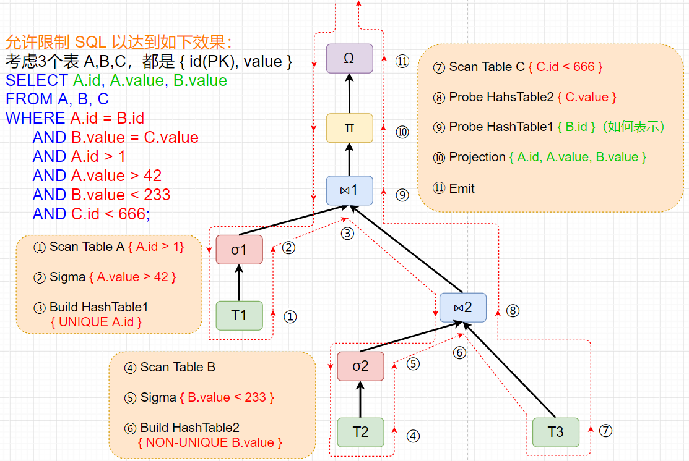
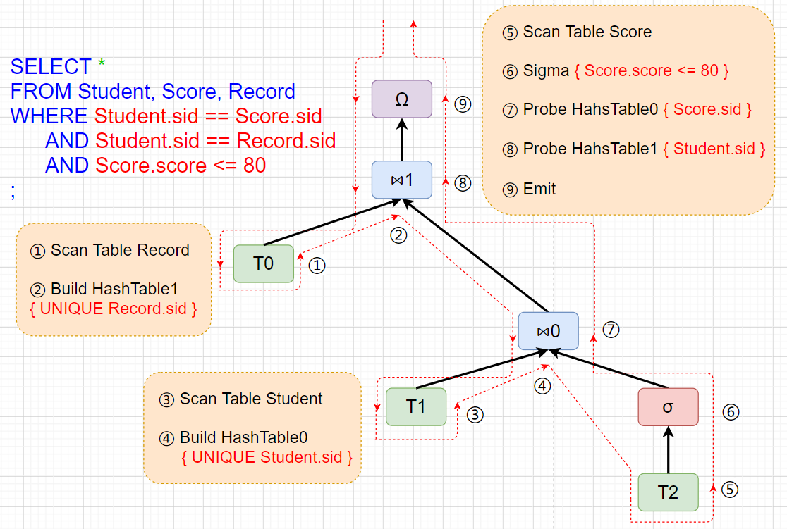
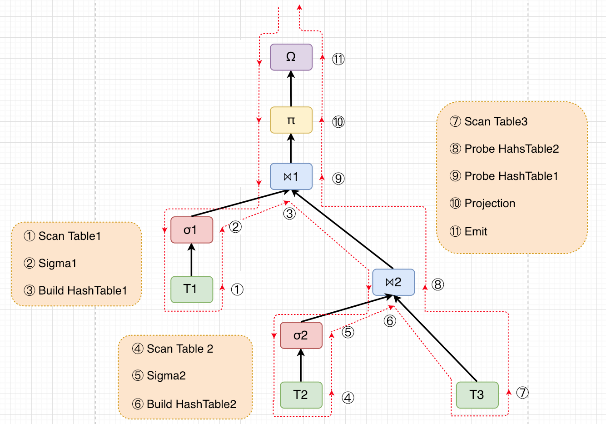

# Query 方案

总结：由 sql 语句构建 query tree；query tree 分块对应到 codegen；为 query 执行提供向量化基础设施。

- [Query Compilation 方案](#query-compile)
  - [SQL 处理](#query-compile-sql)
      - [文法产生式](#query-compile-sql-grammar)
      - [词法分析、语法解析](#query-compile-sql-parser)
      - [语义检查](#query-compile-sql-check)
  - [构建 Query Tree](#query-compile-tree)
  - [生成代码](#query-compile-codegen)
  - [其他](#query-compile-miscellaneous)
- [Query Execution 方案](#query-exec)
  - [query execution 面临的问题及决策](#query-exec-decision)
  - [数据流代码框架](#query-exec-code)
  - [Vectorized Hash Join](#query-exec-simdhashjoin)
  - [其他](#query-exec-miscellaneous)
- [代码生成样例](#codegen-example)




&nbsp;   
<a id="query-compile"></a>
## Query Compilation 方案

Query Compilation 完成 Query 的前两部分工作，即

- 由 sql 语句构建 query tree
- query tree 对应生成 codegen

<a id="query-compile-sql"></a>
### SQL 处理

<a id="query-compile-sql-grammar"></a>
#### 文法产生式

```
sqlStatement := selectStatement | "EXIT" | "SWITCH" | "SHOW";

selectStatement := "SELECT" selectElements fromClause ["WHERE" expression];

selectElements := "$";

fromClause := "FROM" tableName [{"," tableName}*];

tableName := "ID";

columnName := "ID" "." "ID";

expression := expression "AND" expression | predicate;

predicate := expressionAtom comparisonOperator expressionAtom | expressionAtom;

expressionAtom := constantNum | "STR_LITERAL" | columnName | expressionAtomOp;

expressionAtomOp := expressionAtom {"*"|"+"|"-"} expressionAtom;

constantNum := ["-"] positiveNum;
	
positiveNum := "NUMBER_CONSTANT";
				 
comparisonOperator := "==" | ">" | "<" | "<=" | ">=" | "!=";
```

- 主要语句仅有SELECT
- JOIN使用WHERE条件进行
- 逻辑运算符仅支持`AND`
- 数学运算符仅支持`* + -`

<a id="query-compile-sql-parser"></a>
#### 词法分析、语法解析

切割 token，然后使用 LALR 分析，使用 [黎同学](https://github.com/ssyram) 提供的 [NovelRulesTranslator](https://github.com/ssyram/NovelRulesTranslator)，根据 [parse_ap.tsl](https://github.com/rsy56640/xjbDB/blob/query/doc/parse_ap.tsl) 中的 **文法产生式** 及 **规约时的语义动作** 生成 [parse_ap.h](https://github.com/rsy56640/xjbDB/blob/query/code/src/include/parse_ap.h) 文件。

经过语法解析后会得到

- `std::vector<std::pair<std::string, std::string>> columns;`：select 的 column 
- `std::vector<std::string> tables;`：from 后的数据源 table
- `std::vector<std::shared_ptr<ast::BaseExpr>> conditions;`：用 `AND` 连接的 condition

在语法制导翻译后，保留多个条件的集合(由AND逻辑运算符分割)，并未构建成统一的表达式tree。

这是考虑到构建的表达式此后将用于转换成代码，需要良好的结构，而查询语句本身的结构可能并不优雅，与其此后再拆分重组，不如仅保留平铺的多个简单条件集合，再对条件集合进行分类构建。

<a id="query-compile-sql-check"></a>
#### 语义检查

独立的语义检查仅针对条件表达式进行

- 检查简单条件是否为比较表达式
- 检查条件中出现的表的列是否存在
- 对常量间运算进行优化处理

<a id="query-compile-tree"></a>
### 构建 Query Tree

语义检查完成后，将使用此前语法解析得到的几个vector构建query tree。

在构建前首先介绍一下query tree结点，其类型包括

- EMIT：AP特有根结点，用于特殊处理
- PROJECT
- FILTER
- JOIN
- TABLE

它们的基类如下

```c++
class APMap;	// 逻辑列到物理列的映射
struct APBaseOp {
    virtual bool isJoin();	// 判断是否为Join结点
    // 用于代码生成，自顶向下递归调用
    virtual void produce() {}
    // 用于代码生成，自底向上返回
    virtual void consume(APBaseOp *source, APMap &map) {}
    ap_op_t_t op_t_; // 节点类型
    APBaseOp* _parentOp; // 父节点
};
```

#### query tree 自底向上构建

- 对 From 中的每个表构建 Table 结点，检查表的存在性检查推迟到此时进行
- 对条件集合进行筛选，分类成**简单条件**，**Join条件**，**多表复杂条件**
  - 简单条件仅涉及一个表的表列，对于简单条件，在对应的 Table 结点上构建 Filter 结点
  - Join 条件为涉及两个表表列的判等表达式，在参与 Join 的结点上构建 Join 结点
      - 如何找到参与 join 的两个节点，维护映射 table-name(`std::string`) -> table(`APBaseOp*`)
      - 考虑到后续代码生成，若参与 Join 的结点中仅包含一个子 Join 结点，将其调整为右子节点
  - 其他条件为复杂条件，复杂条件暂时还未处理
- 在当前最上层结点上根据 SELECT element 构建 Project 结点
- 在所有节点最上层，生成一个 Emit 结点
- 在最后的 Emit 结点生成前，需要检查构建的结点树是否为森林

#### query tree 生成样例

```sql
SELECT $
FROM Student, Score, Record
WHERE Student.sid == Score.sid AND Student.sid == Record.sid AND Score.score <= 80;
```



<a id="query-compile-codegen"></a>
### 生成代码

在生成 query tree 之后，使用构建的 query tree 生成代码，其主要工作在 APBaseOP 结点的虚函数 `produce()` 和 `consume(...)` 中完成，每个结点类型根据其需要生成的代码实现这两个函数。逻辑列到物理列的映射在 `consume()` 中向上传递。

- `produce()` 函数自顶向下递归调用，由 Emit 结点的 `produce()` 调用开始
  - 根据结点类型，生成其需要的代码行，这里生成的主要是与具体查询无关的固定代码
  - 调用子结点的 `produce()` 函数
      - 若为 Join 结点，依次调用左右子结点
  - 若当前为 Table 结点，则调用父结点的 `consume()` 函数，并将 Table 结点包含的表的物理列映射和来源（即当前节点）向上传递
- `consume()` 函数自底向上返回
  - 返回过程中维护和传递中间表结构到物理列的映射
  - 根据结点类型以及从下层获得的映射，生成代码行
  - 将当前的物理列映射和来源（即当前节点）向上传递，若当前为 Join 结点，在传递前需要更新映射

生成的代码行与 query tree 结构的对应是优雅的，对于此前 SQL 语句生成的 query tree，其生成的代码如下（由于 `produce()` 生成的代码部分是平凡的，不做标记。序号表示代码为 `consume()` 生成，需要注意，对于 Join 结点，该函数会被左右子节点调用两次，分别用两个序号表示）

```c++
static DB::ap::block_tuple_t projection(const DB::ap::block_tuple_t &block) { return block; }

extern "C"
DB::ap::VMEmitOp query(const DB::ap::ap_table_array_t &tables, DB::vm::VM *vm) {

    DB::ap::VMEmitOp emit;
    const DB::ap::ap_table_t &T0 = tables.at(0);                                        //①
    const DB::ap::ap_table_t &T1 = tables.at(1);                                        //③
    const DB::ap::ap_table_t &T2 = tables.at(2);                                        //⑤
    DB::page::range_t rngLeft0{0, 4};                                                      //②
    DB::page::range_t rngRight0{0, 4};	                                                   //⑧
    DB::page::range_t rngLeft1{0, 4};                                                      //④
    DB::page::range_t rngRight1{0, 4};                                                    //⑦
    DB::ap::hash_table_t ht0(rngLeft0, rngRight0, 24, 8, true);                   //⑧
    DB::ap::hash_table_t ht1(rngLeft1, rngRight1, 8, 32, true);                   //⑦


    auto pipeline0 = [&]() {                                                                      //①
        for (DB::ap::ap_block_iter_t it = T2.get_block_iter(); !it.is_end();) {   //①
            DB::ap::block_tuple_t block = it.consume_block();                        //①

            ht1.insert(block);	                                                                       //②
        }                                                                                                  //②
        ht1.build();                                                                                    //②
    };                                                                                                     //②
    std::future<void> future0 = vm->register_task(pipeline0);                    //②


    auto pipeline1 = [&]() {                                                                      //③
        for (DB::ap::ap_block_iter_t it = T0.get_block_iter(); !it.is_end();) {   //③
            DB::ap::block_tuple_t block = it.consume_block();                        //③

            ht0.insert(block);                                                                       //④
        }                                                                                                  //④
        ht0.build();                                                                                    //④
    };                                                                                                     //④
    std::future<void> future1 = vm->register_task(pipeline1);                    //④


    auto pipeline2 = [&]() {                                                                                            //⑤
        for (DB::ap::ap_block_iter_t it = T1.get_block_iter(); !it.is_end();) {                        //⑤
            DB::ap::block_tuple_t block = it.consume_block();                                              //⑤

            block.selectivity_and(block.getINT({4, 4}) <= 80);                                              //⑥

            DB::ap::join_result_buf_t join_result0 = ht0.probe(block);                                   //⑦
            for (DB::ap::ap_block_iter_t it = join_result0.get_block_iter(); !it.is_end();){        //⑦
                DB::ap::block_tuple_t block = it.consume_block();                                          //⑦

                DB::ap::join_result_buf_t join_result1 = ht1.probe(block);                               //⑧
                for (DB::ap::ap_block_iter_t it = join_result1.get_block_iter(); !it.is_end();) {   //⑧
                    DB::ap::block_tuple_t block = it.consume_block();                                      //⑧

                    emit.emit(block);                                                                                     //⑨
                }                                                                                                               //⑨
            }                                                                                                                   //⑨
        }	                                                                                                                       //⑨
    };                                                                                                                          //⑨
    std::future<void> future2 = vm->register_task(pipeline2);                                          //⑨

    future2.wait();                                                                                                         //⑨
    return emit;                                                                                                            //⑨

}
```

代码生成后，对其编译生成`.so`文件，并动态载入，进行查询

<a id="query-compile-miscellaneous"></a>
### 其他


&nbsp;   
<a id="query-exec"></a>

## Query Execution 方案



总体来说不复杂，对于生成的代码来说，输入是一系列表，输出是一张表，query-exec 事实上应该提供 **数据流访问基础设施** 和 **节点功能** 就OK了。

<a id="query-exec-decision"></a>
### query execution 面临的问题及决策

如果选择每个结点间传递 tuple 的话，那其实是非常简单的 pipeline style，但是因为决定要做 simd hash join，所以决定以 block 为单位传递。

遇到了一些困难，尤其是**数据组织形式**，和 **pipeline 控制流**：

- **数据组织形式**
  - row content
      - 不用额外维护一些表示关系，尤其是 join，所以**决定用 row content**
  - row handler
      - join 之后的表示
          - join 输出全部存着
          - 存对应的两个 row handler，并且存对应的 splice 方法
- **pipeline 控制流**
  - Table 输出 block
  - Sigma 输入 block，输出 block
  - Join Build 输入 block
  - Join Probe 输入 block，输出 不定量 tuple
      - 输出以 block 为单位遍历
  - Projection 输入 block，输出 block
  - 一开始想法是 block 要不要沿着 pipeline 一直走，思考另一种方案很久：block 攒够 8 个才继续走。比如说 join probe，需要在右边放一个 buffer 做贮存工作，这样会极大的影响 control flow。比如 table 拿出来8个 tuple，经过 sigma，只剩5个，那么就需要重新去拿。这使得 pipeline 从 stateless 变为 stateful。此外 table 中结束后，还需要检查所有 buffer 是否有剩余，重新走一遍
  - 最简单方案是 codegen 的代码可以分块对应到 query tree，所以我**决定让 block 沿着 pipeline 一直走**

<a id="query-exec-code"></a>
### 数据流代码框架

数据以 block 形式在结点间传递：

- `class ap_table_t;`：table 结点
  - 提供 `ap_block_iter_t`
- `class join_result_buf_t;`：hash probe 的结果，作为 join 结点的输出
  - 提供 `ap_block_iter_t`
- `class ap_block_iter_t`：块迭代器
  - 来源于 `class ap_table_t;` 或 `class join_result_buf_t;`
  - 判断是否结束 `bool is_end() const;`
  - 向后消费 block `block_tuple_t consume_block();`
- `class block_tuple_t`：数据流基本单位，aka 一个块
  - 提供 `block_tuple_iter_t` 用于遍历 tuple
  - `VECTOR_INT getINT(page::range_t range) const;`：向量化运算基础设施
  - 复杂条件，如多表数字计算，字符串比较，`block_tuple_iter_t` 提供块内部的单个 row 访问
- `class hash_table_t;`
  - `void insert(const block_tuple_t&);`：hash build 结点，将数据流在此 break
  - `void build();`：insert 结束后，进行 build
  - `join_result_buf_t probe(const block_tuple_t&) const;`：probe 结点，输入 block，输出若干个 block
- `struct VECTOR_INT;`
  - 表示 8 个 int32
  - arithmetic 运算
  - logical 运算
  - mask 运算
  - gather

<a id="query-exec-simdhashjoin"></a>
### Vectorized Hash Join

- [Vectorization vs. Compilation in Query Execution 论文阅读笔记](https://github.com/rsy56640/paper-reading/tree/master/%E6%95%B0%E6%8D%AE%E5%BA%93/content/Vectorization%20vs.%20Compilation%20in%20Query%20Execution)
- [Rethinking SIMD Vectorization for In-Memory Databases 论文阅读笔记](https://github.com/rsy56640/paper-reading/tree/master/%E6%95%B0%E6%8D%AE%E5%BA%93/content/Rethinking%20SIMD%20Vectorization%20for%20In-Memory%20Databases)

<a id="query-exec-miscellaneous"></a>

### 其他

- 多线程执行：以 pipeline 为单位任务
  - pipeline breaker 就要支持同步功能
      - hash join 结点的 build 最后通知完成，probe 开始要等待通知完成
      - 由于 emit 结点的数据在 local，所以在返回之前要等待完成。因此在 `return emit;` 之前加了一句 `future_last.wait();`
- 由于只有 AVX2 的支持，SIMD compare 是用位运算模拟的。另外 AVX 对 mask 的支持很诡异，之前看向量化论文的很多想法都很难实现，用 AVX2 感觉就像戴着枷锁跳舞


&nbsp;   
<a id="codegen-example"></a>
## 代码生成样例

```c++
//////////////////////////////////////////////////////////////////
//////////////////////  example of codegen  //////////////////////
//////////////////////////////////////////////////////////////////
#include "ap_exec.h"

static
DB::ap::block_tuple_t example_projection(const DB::ap:: block_tuple_t& block) {
    return block;
}

extern "C"
DB::ap::VMEmitOp example_query(const DB::ap::ap_table_array_t& tables) {
    const DB::ap::ap_table_t& T1 = tables.at(1);
    const DB::ap::ap_table_t& T2 = tables.at(2);
    const DB::ap::ap_table_t& T3 = tables.at(3);
    DB::page::range_t rng1{ 0, 4 };
    DB::page::range_t rng2{ 4, 4};
    DB::page::range_t rng3{ 4, 4 };
    DB::page::range_t rng_j2{ 0, 4 };
    DB::ap::hash_table_t ht1(rng1, rng_j2, 8, 8, true);
    DB::ap::hash_table_t ht2(rng2, rng3, 8, 16, false);
    DB::ap::VMEmitOp emit;


    for(DB::ap::ap_block_iter_t it = T1.get_block_iter(); !it.is_end();) {
        DB::ap::block_tuple_t block = it.consume_block();

        block.selectivity_and(block.getINT({ 4, 4 }) > 42);

        ht1.insert(block);
    }
    ht1.build();


    for(DB::ap::ap_block_iter_t it = T2.get_block_iter(); !it.is_end();) {
        DB::ap::block_tuple_t block = it.consume_block();

        block.selectivity_and(block.getINT({ 4, 4 }) < 233);

        ht2.insert(block);
    }
    ht2.build();


    for(DB::ap::ap_block_iter_t it = T3.get_block_iter(); !it.is_end();) {
        DB::ap::block_tuple_t block = it.consume_block();

        DB::ap::join_result_buf_t join_result2 = ht2.probe(block);
        for(DB::ap::ap_block_iter_t it = join_result2.get_block_iter(); !it.is_end();) {
            DB::ap::block_tuple_t block = it.consume_block();

            DB::ap::join_result_buf_t join_result1 = ht1.probe(block);
            for(DB::ap::ap_block_iter_t it = join_result2.get_block_iter(); !it.is_end();) {
                DB::ap::block_tuple_t block = it.consume_block();

                block = example_projection(block);

                emit.emit(block);
            }
        }
    }

    return emit;

} // end example_codegen function
```
